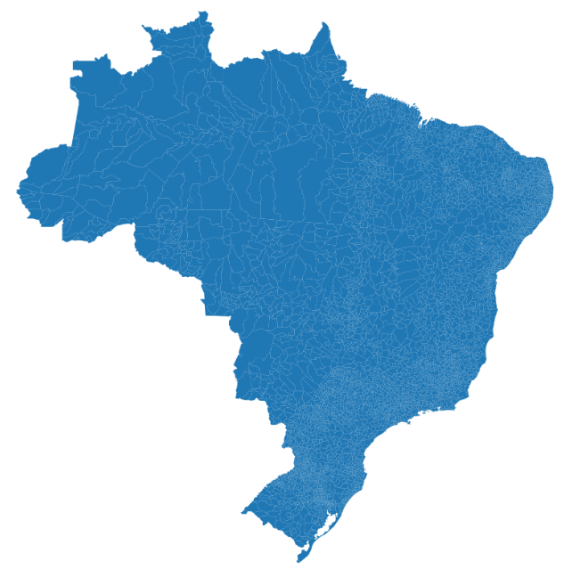

# geodata-brasil
Dados de geolocalização de municípios e Estados brasileiros em GeoJSON.



Para instalar as bibliotecas utilizadas:
```
pip install requirements.txt
```

# Forma de uso
## Arquivos
Na pasta [data/municipios](https://github.com/alimarques/geodata-brasil/tree/main/data/municipios) estão localizados os arquivos json de cada UF brasileira. Em cada arquivo os dados correspondem à geolocalização de todos os municípios daquela UF específica. O arquivo `municipios.json` corresponde a união de todos os municípios do Brasil.

Na pasta [data/estados](https://github.com/alimarques/geodata-brasil/tree/main/data/estados) está localizado o arquivo `estados.json` corresponde a união de todos as UF do Brasil.

## Script
O arquivo [main.py](https://github.com/alimarques/geodata-brasil/blob/main/src/main.py) possui os scripts para gerar as chamadas necessárias à API do IBGE e salvar o arquivo de geolocalização correspondente.

# Fonte
- API de listagem de municípios pelo IBGE. https://servicodados.ibge.gov.br/api/docs/localidades#api-Municipios-municipiosGet
- API de malhas geográficas do IBGE. https://servicodados.ibge.gov.br/api/docs/malhas?versao=3
